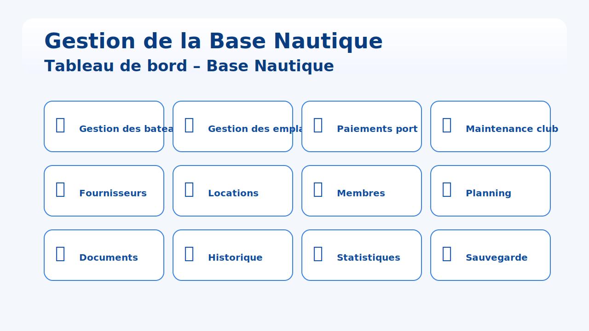

# Gestion de la Base Nautique



## Présentation

Application web de gestion d'une base nautique construite avec [Flask](https://flask.palletsprojects.com/) et une base de données SQLite. Elle centralise la flotte, les emplacements, les membres, les locations, la maintenance et la facturation portuaire au sein d'un tableau de bord unique.

## Fonctionnalités clés

- Tableau de bord regroupant les accès rapides vers les modules métier (bateaux, emplacements, paiements, maintenance, fournisseurs, locations, membres, planning, documents, historique, statistiques, sauvegarde).
- Fiches détaillées pour les bateaux, membres, fournisseurs et opérations de maintenance, avec gestion des pièces jointes.
- Gestion des locations et de l'agenda avec visualisation planifiée.
- Sauvegarde et restauration de la base `data/app.db` directement depuis l'interface.
- Export CSV pour de nombreuses sections (membres, fournisseurs, maintenance, historique, etc.).

## Prérequis

- Python 3.10 ou supérieur.
- `pip` pour installer les dépendances Python.
- Dépendances Python : `Flask`, `Pillow`.

Un interpréteur Python portable est fourni pour Windows dans le dossier `Python312/` (utilisé par `lancer.cmd`).

## Installation

```bash
# Cloner le dépôt puis se placer à sa racine
git clone <url-du-depot>
cd Gestion-base-nautique

# (Optionnel) créer un environnement virtuel
python -m venv .venv
source .venv/bin/activate  # Sous Windows : .venv\\Scripts\\activate

# Installer les dépendances
pip install Flask Pillow

# Initialiser la base si nécessaire
python init_db.py
```

## Lancement

```bash
python app.py
```

Le serveur démarre sur `http://127.0.0.1:5000/` et ouvre le navigateur par défaut. La base de données (`data/app.db`) est créée automatiquement si elle n'existe pas.

## Structure du projet

- `app.py` : application Flask et routes métier.
- `templates/` : gabarits HTML (Bootstrap).
- `static/` : ressources statiques (styles, scripts, logo).
- `data/` : base SQLite créée au premier lancement.
- `schema.sql` : définition du schéma de la base.
- `init_db.py` : initialisation manuelle de la base.
- `docs/` : documentation et visuels (dont `dashboard.svg`).

## Sauvegarde et restauration

Depuis l'interface, le module **Sauvegarde** permet :

- d'exporter une archive ZIP contenant le dossier `data/` ;
- d'importer une sauvegarde préalablement exportée (avec conservation automatique d'une copie de sécurité).

## Support et personnalisation

- Les styles peuvent être adaptés dans `static/style.css` et les ressources graphiques dans `static/`.
- Le fichier `DESCRIPTION.md` détaille l'architecture complète, les modules et le processus de sauvegarde/restauration.

